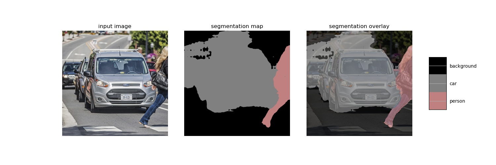

## Image Segmentation With TFLite on BrainyPi 
## Description
We will be implementing image segmentation application on BrainyPi using DeepLab (mobilenetv2_dm05_coco_voc_trainval) trained on PASCAL VOC dataset.

## Install TFlite on BrainyPi
```sh
pip3 install tflite-runtime
```

## Clone the repository
  ```sh
  git clone https://github.com/brainypi0/BrainyPi-AI-Examples.git
  cd BrainyPi-AI-Examples/TFLite/ImageSegmentation
  ```

## Run Image segmentation example
```sh
python3 imageSegmentaion.py 
```

- Input
  - Parameter1: --image_dir: Image file location. (default='images/car.jpg')
  - Parameter2: --save_dir: Directory path to save the result image. (default='results/result.jpg')
- Output
  - Shows the segmentation and overlay with class labels in the output image.
  
## Sample Input and Output images


  
## Original Documentation and Model
https://tfhub.dev/sayakpaul/lite-model/mobilenetv2-dm05-coco/fp16/1
