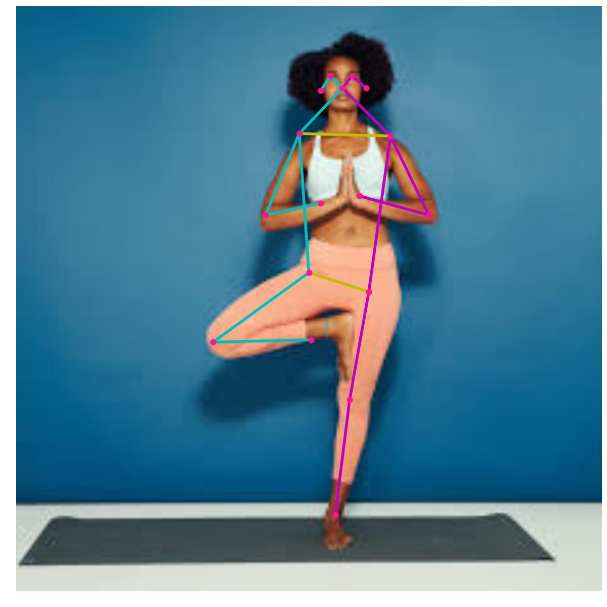

## Pose Estimation With TFLite on BrainyPi 
## Description
We will be implementing pose estimation application on BrainyPi using MoveNet (movenet/singlepose/lightning/tflite/int8).

## Install TFlite on BrainyPi
```sh
pip3 install tflite-runtime
```

## Clone the repository
  ```sh
  git clone https://github.com/brainypi0/BrainyPi-AI-Examples.git
  cd BrainyPi-AI-Examples/TFLite/PoseEstimation
  ```

## Run Pose Estimation example
```sh
python3 poseEstimation.py 
```

- Input
  - Parameter1: --image_dir: Image file location. (default='images/pose1.jpeg')
  - Parameter2: --save_dir: Directory path to save the result image. (default='results/result.jpg')
- Output
  - Marks the keypoints on the image (The model is trained on images with a single person only)
  
## Sample Input and Output images


  
## Original Documentation and Model
https://tfhub.dev/google/lite-model/movenet/singlepose/lightning/tflite/int8/4
