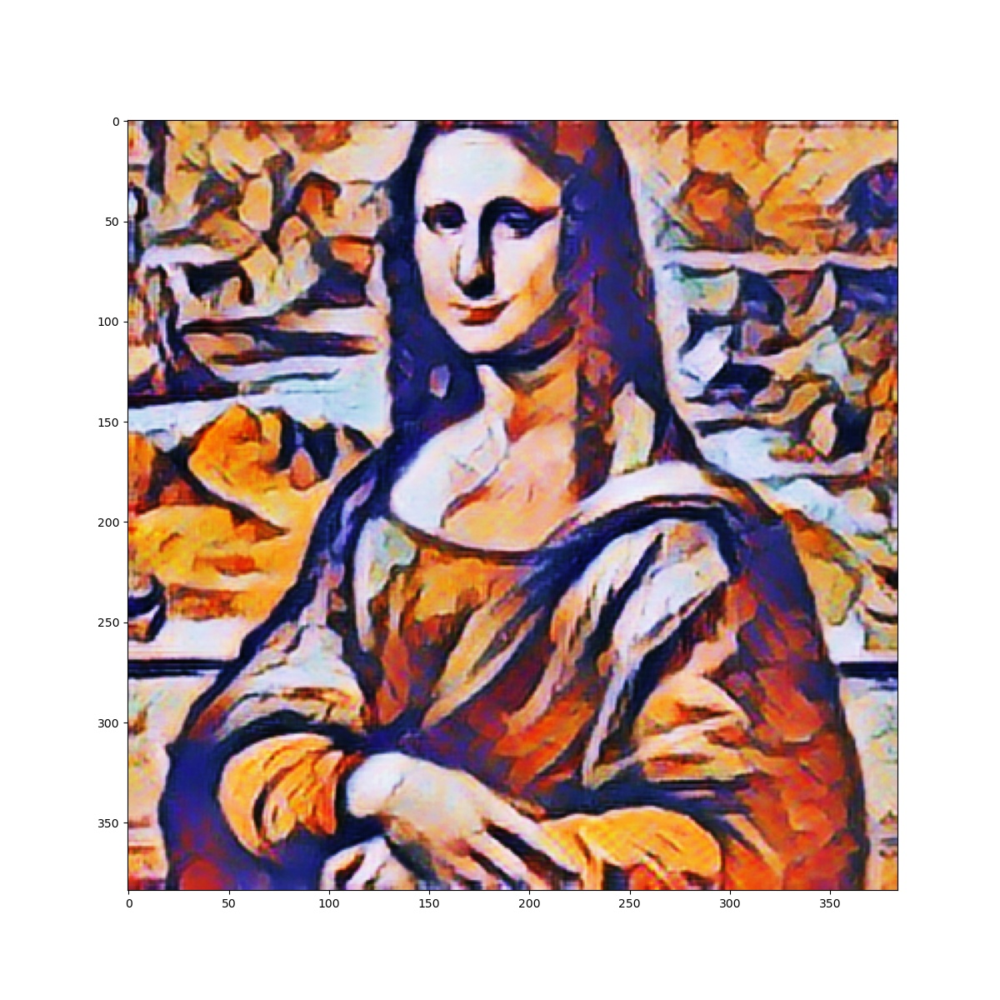

## Style Transfer With TFLite on BrainyPi 
## Description
We will be implementing style transfer application on BrainyPi using magenta/arbitrary-image-stylization-v1-256 from tensorflow hub.

## Install TFlite on BrainyPi
```sh
pip3 install tflite-runtime
```

## Clone the repository
  ```sh
  git clone https://github.com/brainypi/BrainyPi-AI-Examples.git
  cd BrainyPi-AI-Examples/TFLite/StyleTransfer
  ```

## Run Style Transfer example
```sh
python3 styleTransfer.py 
```

- Input
  - Parameter1: --style_image_dir: style Image file location. (default='images/style.jpg')
  - Parameter2: --content_image_dir: content Image file location. (default='images/content.jpg')
  - Parameter3: --save_dir: Directory path to save the result image. (default='results/result.jpeg')
- Output
  - Shows the Stylized image as a combination of content and style images.
  
## Sample Input and Output images
                 

  
## Original Documentation and Model
https://tfhub.dev/google/lite-model/magenta/arbitrary-image-stylization-v1-256/int8/transfer/1
