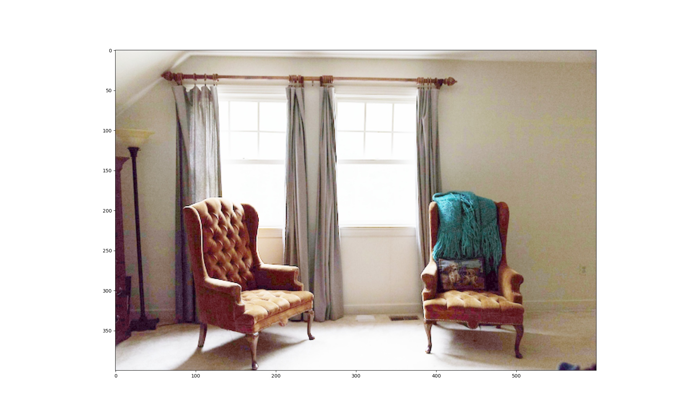

## Low light image enhancement With TFLite on BrainyPi 
## Description
We will be implementing  Low light image enhancement application on BrainyPi using zero-dce model.

## Install TFlite on BrainyPi
```sh
pip3 install tflite-runtime
```

## Clone the repository
  ```sh
  git clone https://github.com/brainypi0/BrainyPi-AI-Examples.git
  cd BrainyPi-AI-Examples/TFLite/SuperResolution
  ```

## Run Pose Estimation example
```sh
python3 superResolution.py 
```

- Input
  - Parameter1: --image_dir: Image file location. (default='images/low.jpg')
  - Parameter2: --save_dir: Directory path to save the result image. (default='results/result.jpg')
- Output
  - Saves an enhanced image in the specified directory. 
  
 ## Sample Input and Output images


  
## Original Documentation and Model
https://tfhub.dev/sayannath/lite-model/zero-dce/1
